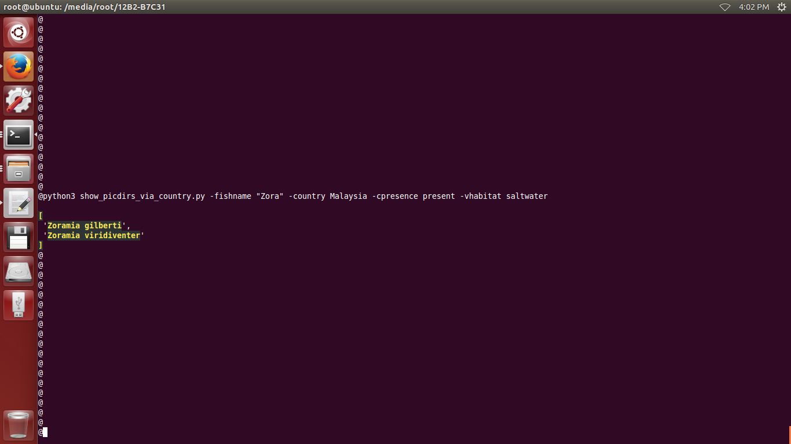
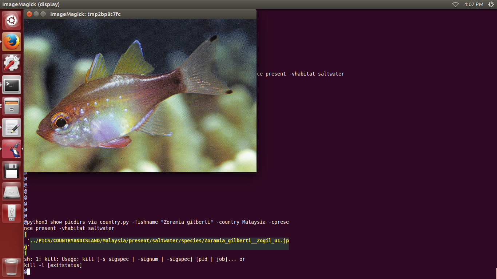
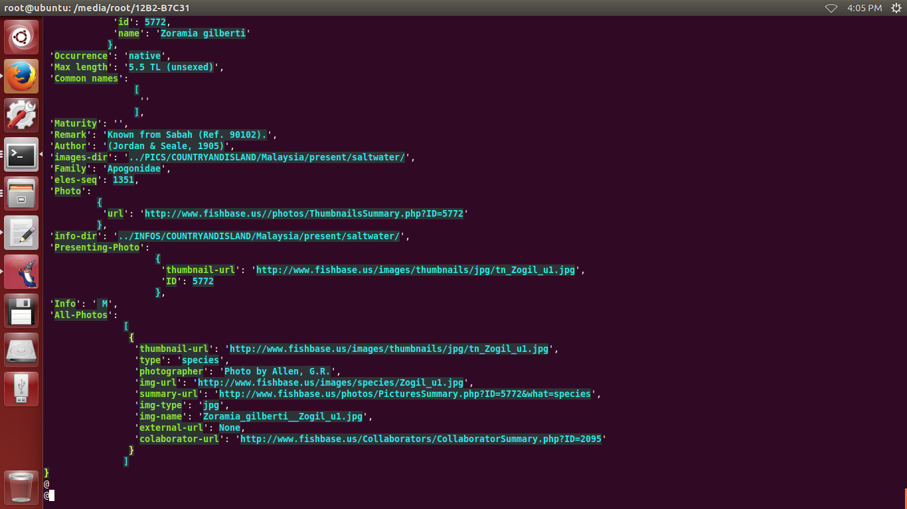

# FISHBASEHELPER
this is a search helper for website http://www.fishbase.us

## USAGE:
1. search fishname:  
-------------------  

    python3 show_picdirs_via_country.py -fishname "Zora" -country Malaysia -cpresence present -vhabitat saltwater  

    
2. show pictures via fishname:  
------------------------------  

    python3 show_picdirs_via_country.py -fishname "Zoramia gilberti" -country Malaysia -cpresence present -vhabitat saltwater  

3. show info via picname:  
-------------------------  

    python3 show_fishinfo_via_country.py -picname Zoramia_gilberti__Zogil_u1.jpg -country Malaysia -cpresence present -vhabitat saltwater

4. search country code:  
----------------------- 

    python3 show_fishinfo_via_country.py -picname Zoramia_gilberti__Zogil_u1.jpg -country Malaysia -cpresence present -vhabitat saltwater

5. show country code:  
---------------------  

    python3 show_country_code.py Malaysia

6. get dadabase via country:  
----------------------------  

    it will be stored in ./INFOS ./PICS ./THUMBNAILS ,this operation just need to be called once  
    
    cd ./WEBCRAWLER/  
    python3 fishbase.us.country.py -country_code 458 -cpresence present -vhabitat saltwater

